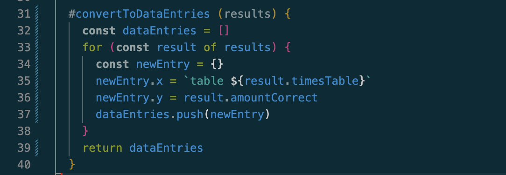

# Reflektion
## Kapitel 2 - Meaningful Names
Jag har försöka följa **One Word Per Concept**, en detekterad brist nämnt i tidigare reflektion. Jag håller med om att metoder som åstadkommer samma saker, fungerar på likvärdiga sätt bör ha samma prefix (så som 'add', 'remove', 'clear' etc). 
Jag har tänkt mycket under utvecklingen av min app på att ha så beskrivande och **Intention-Reavealing** namn på mina variabler och metoder som möjligt. 
Jag tycker detta hänger mycket ihop med kommentarer, och det eventuella behovet av kommentarer - hur det beror på vår namngivning. 
I bilden nedan visas en metod i 'model/corrector.js' som returnerar en boolean döpt till 'is...' - Vilket går i linje med **One Word Per Concept** eftersom det är ett etablerat koncept (inte bara mitt koncept) att en is-metod returnerar en boolean. 
Jag tycker att namngivningarna för 'userAnswer' och 'correctAnswer' är ett bra exempel för lagom **meaningful distinctions**.

## Kapitel 3 - Functions
I Clean Code kapitel 3 står det om hur våra metoder ska vara **Small!** och gärna inte ha en indentering som överstiger 1 eller 2 steg inåt. 
Jag har märkt under min implementering att jag tenderar att ägna mig åt nästlade if-satser och for-loopar. 
Under **Blocks and indenting** beskrivs det att innehållet i en for-loop eller if-sats bör vara en rad lång och då antagligen ett metodanrop. I bilden nedan från 'model/graph.js' har jag valt att behålla min metod som den är. 
Metoden är i sig ganska liten och en variabeldeklaration behövs utanför loopen men nåbar inom loopen. 
Vad som sker i loopen behöver också ha tillgång till det inskickade argumentet 'result'. 
Om jag skulle bryta ut det som är inom for-loopen till ett endaste metodanrop skulle den metoden behöva ta in både den deklarerade variabeln 'dataEntries' samt ett resultat som argument. 
Den nya metoden skulle bli mer komplex då den vore en **dyadic** vilket det i sig finns massvis av exempel på i min kod, men här tycker jag att det blir onödigt och snarare skulle försvåra förståelsen och läsbarheten i koden.

## Kapitel 4 - Comments
Jag har valt att till största del inte använda mig av JSDoc då jag tycker att namngivningen och kommentarer går hand i hand och insåg hur jag genom att välja intention revealing och distinktiva namn upplevde nästan varje kommentar som redundant. 
I min model är många av filerna mindre specifika än vad de i controller och view är - flera klasser är mer eller mindre återanvändbara och är mer low coupled - jag har därför valt att använda JSDoc för mina publika metoder (Inte alla getters etc, då jag tyckte att det bara blev **noise comments**) - då jag själv som utvecklare tycker att det underlättar med JSDoc i min editor då jag genast ser datatypen för respektive argument. 
Bilden nedan är från 'model/generator.js' och jag visar ett exempel på när jag tycker att metodkommentaren är nödvändig och tillför information. 
Boken beskriver hur 'Function Headers' är onödiga om man har ett välvalt namn för en liten funktion som gör en sak (vilket är så den ska vara) - I mitt fall blev mina välvalda namn ändå långa och komplicerade, men jag behövde ytterliggare sätt att kommunicera min kod. 
Jag tycker att kommentarer är nödvändiga - där dom behövs. 
Jag tycker att den här behövs eftersom den hjälper mig att förstå och eftersom jag inte kom längre med min namngivning.

## Kapitel 5 - Formatting
Jag har försökt hålla en **vertical ordering** med mina **dependent functions** genom att ha **Caller above callee**. 
Det var inte möjligt att göra varje metodanrop ordnade i rad. 
I min controller var detta nästintill helt möjligt.
I min modul var detta också svårt, jag valde där att till stor del utgå ifrån **conceptual affinity** som jag ibland tyckte passade bättre, då jag valde att ha liknande metoder intill varandra vertikalt.

## Kapitel 6 - Objects and Data Structures
Jag följer **law of demeter** - alltså hittar jag inga **trainwrecks** i min kod, inga objekt som anropar objekt dom inte känner. 
Angående datastrukturer tyckte jag det var intressant som pratades om under föreläsningen gällande arrayer, när en datastruktur är lämplig eller inte, hur elementen bör vara av samma typ samt av samma **konceptuella typ**. 
I min modul hade jag två medlemsvariabler (två arrayer), en döpt till 'xCollection' och en till 'yCollection'. 
För att hitta en specifik punkt krävdes att extrahera samma index ur respektive array. 
Jag gjorde om detta till en array som istället innehåller objekt med x och y properties.

## Kapitel 7 - Error Handling
Den metod som startar min applikation har en 'try catch' och fångar eventuella fel som kastas när applikationen körs. 
Jag har även behövt 'try catch' i mina event listeners eftersom dessa fångar fel som skulle kunna uppstå asynkront. 
I applikationens övriga delar kastas Exceptions där det behövs, jag returnerar exempelvis inte null.
Jag tycker att det här går i linje med min tidigare uppfattning och erfarenhet.

## Kapitel 8 - Boundaries
Jag har isolerat den delen av min kod som använder sig av ett externt bibliotek (alltså min modul) i 'model/graph.js'.
Det är den enda klassen som använder extern kod. 
Eftersom användandet av tredjepartskod är isolerad till denna klassen är det lättare att underhålla vår kod, eftersom om någonting händer med modulen så uppstår felet där den används.
Klassens enda uppgift är att kommunicera med modulen.

## Kapitel 9 - Unit Tests
Jag har inte skrivit några automatiska enhetstester och har därför svårt att reflektera över hur kapitlet påverkat mitt arbete. 
Jag kan väl säga att **Clean Tests** även är applicerbart oavsett om du skriver tester i kod eller beskriver dem med ord. 
Jag försökter att vara kortfattad och tydlig när jag skriver mina testfall. 
Jag försöker att de manuella kontrollerna ska vara mätbara, och fungera som om de returnerade en boolean - för att validera att ett test passerade eller inte.

## Kapitel 10 - Classes
'view/radioInput.js' och 'view/Output.js' har flera metoder som inte använder sig av klassens privata fält, vilket jag tyckte var intressant under föreläsningen att se som en riktlinje för när en klass eventuellt bör brytas ut till flera klasser.
Ändå väljer jag att behålla dessa metoder inom samma klass då jag tycker ätt det är enhetligt och håller **high cohesion** då metoderna har liknande avsikter och hör ihop. 
Jag har valt att ha en egen klass för att skapa ett Canvas element för att följa **single responsibility principle**. 
'view/canvas.js' är ett tydligt exempel på en liten klass, som gör det den ska och kanske borde och ingenting annat.

## Kapitel 11 - Systems
Jag har svårt att greppa detta kapitel och hur jag ska relatera det till denna uppgift. 
Jag tolkar det som att det förespråkar **Separation of Concerns** när vi talar om system och hur olika komponenter arbetar och fungerar tillsammans utan att känna till "the big picture" - att det är så mjukvara bör utvecklas. Kapitlet nämner ingenting om 'model-view-controller' design specifikt men jag anser att det grundar sig i samma approach.
Jag för samman de klasser som har liknande uppgifter eller hanterar liknande delar av systemet.
Jag försöker att hålla **low coupling** genomgående, däremot blir controllern lätt lite kladdig - samtidigt är det dens uppgift att vara mer av en dirigent för systemet i min uppfattning.
 

