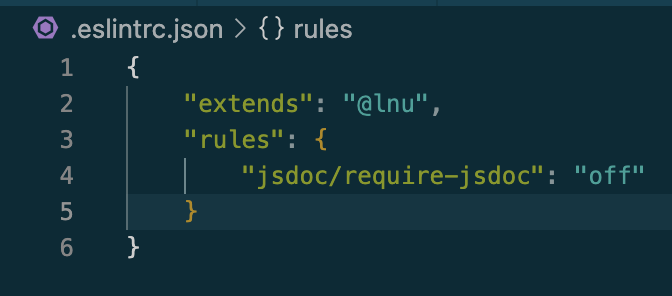

# Kravspecifikation Times Tables Test

## Inledning
Denna kravspecifikation beskriver de viktigaste funktionella och icke-funktionella kraven för appens utveckling. Varje funktionellt krav har testats. Varje icke-funktionellt krav har efterföljts om kravet inte anses mätbart eller lämpligt för testning. 

## Funktionella krav
1. Interaktivt test
  1.1 Applikationen ska erbjuda användaren ett interaktivt test där multiplikationsproblem presenteras, och användaren kan besvara dem.
  1.2 När användaren besvarar ett problem ska ett nytt problem presenteras omedelbart.
2. Anpassningsbarhet
  2.1 Användaren ska ha möjlighet att anpassa antalet problem per multiplikationstabell.
3. Resultat
  3.1 Appen ska generera en översiktlig graf över användarens resultat.
  3.2 Grafen ska tydligt visa hur många problem som besvarades korrekt för respektive multiplikationstabell.
4. Användar Gränssnitt
  4.1 Applikationens gränssnitt ska innehålla ständigt synliga knappar för navigering.
## Icke-funktionella krav
1. Teknisk stack
  1.1 Applikationen ska byggas med JavaScript, HTML och CSS.
  1.2 Applikationen ska driftsättas med Netlify.
  1.3 Externt bibliotek very-simple-bar-chart ska användas för att generera diagram.
2. Kodkvalitet
  2.1 Koden ska hela tiden utvecklas med strävan efter att kommunicera väl och vara och efterföljs i största mån utifrån principer som nämns i Clean Code av Robert C. Martin.
  2.2 Koden utvecklas med LNUs config av ESLint för att hålla standard för formattering*.
3. Tillgänglighet
  3.1 Applikationen är nåbar på internet

* LNUs config av ESLint är manipulerat för att inte kräva JSDoc intill varje skriven metod. 